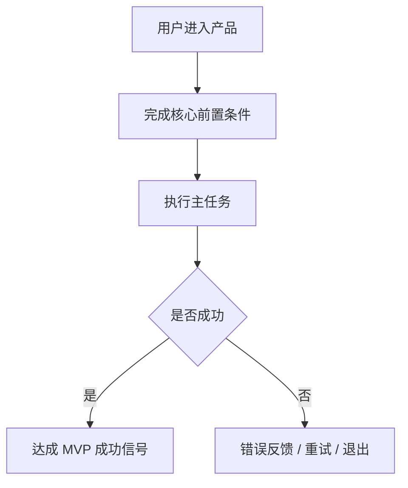
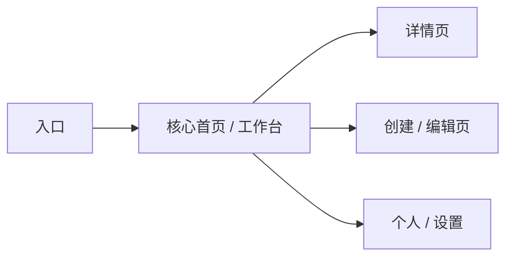
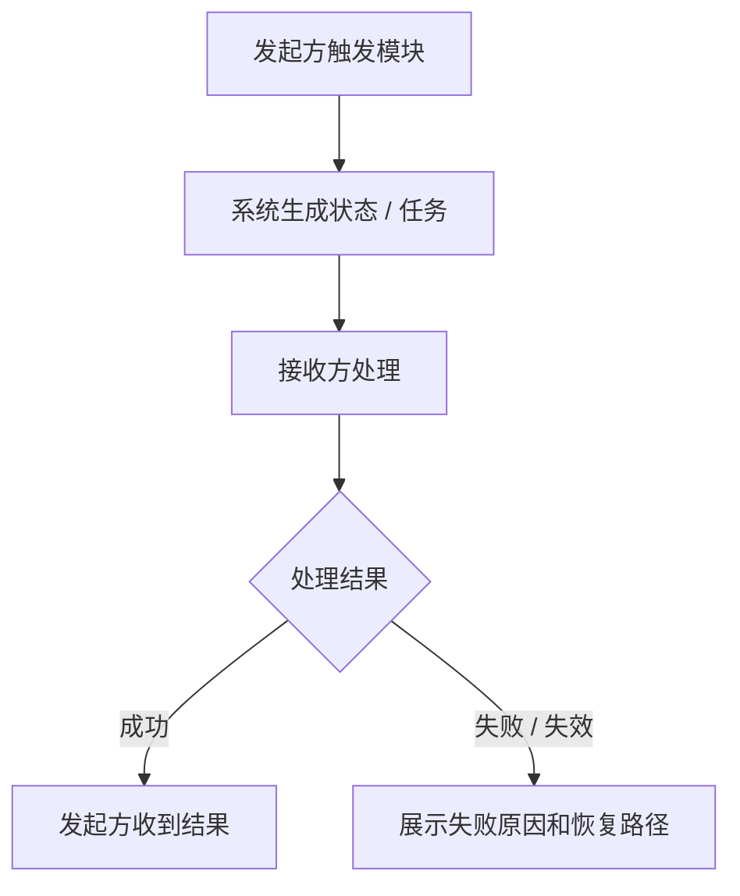
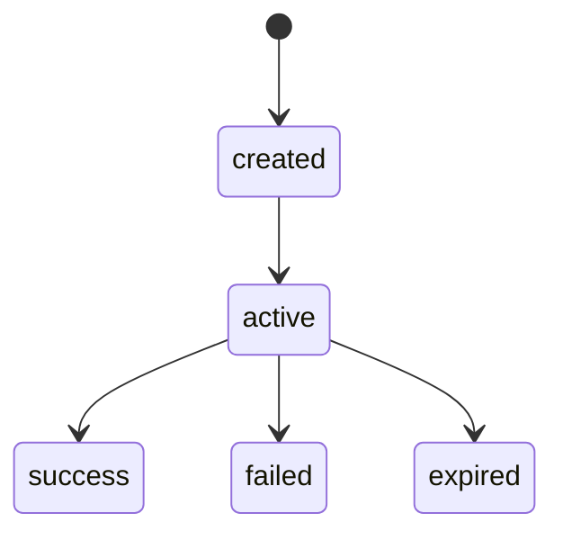

# PM Assistant 产物模板

当用户要求正式输出、生成 PRD、模块详设、开发交接或建立新迭代时读取本文件。

正式产物只写入版本化目录：

```text
pm-output/
└── iterations/
    └── <version>/
        ├── PRD.md
        ├── modules/
        │   ├── 01-<模块名>.md
        │   └── 02-<模块名>.md
        ├── 开发交接.md
        ├── 迭代摘要.md
        ├── 决策日志.md
        ├── 未决问题.md
        └── 调研材料.md
```

不要默认生成所有文件。默认正式输出优先生成一份完整 `PRD.md`；当产品包含多个功能模块、已有产品迭代、多入口链路、邀请 / 分享 / 授权 / 支付 / 积分 / 审核 / H5-App 跳转等复杂场景时，必须生成 `modules/` 模块详设。用户要求开发实现交接时生成 `开发交接.md`。已有版本目录默认禁止覆盖；除非用户明确要求覆盖 / 修正当前版本，否则创建新版本目录。

文件命名规则：
- `PRD.md` 保持英文文件名，作为默认总入口。
- `modules/` 保存模块级真实颗粒度详设，文件名使用 `<序号>-<中文模块名>.md`。
- 开发实现契约统一命名为 `开发交接.md`。
- 产品决策、交互说明、原型布局和验收标准不再单独成文件，必须进入 `PRD.md` 和 `modules/`。
- PM Assistant 不生成 `design-output/`，具体视觉稿、HTML/CSS/SVG 原型和截图验证属于设计 / 原型工具职责。

## 迭代摘要.md

```markdown
# 迭代摘要

## 产品名称

## 版本

## 迭代类型
- 首版 / 小修订 / 中迭代 / 大版本：

## 本轮目标

## 本轮新增

## 本轮修改

## 本轮删除或延后

## 关键取舍

## 未验证假设

## 下一步
```

## 决策日志.md

```markdown
# 决策日志

| 时间 / 阶段 | 决策 | 备选方案 | 选择原因 | 风险 | 状态 |
|-------------|------|----------|----------|------|------|
```

## 未决问题.md

```markdown
# 未决问题

| ID | 问题 | 影响 | 推荐答案 | 负责人 | 截止阶段 | 状态 |
|----|------|------|----------|--------|----------|------|
```

## 调研材料.md

```markdown
# 调研材料

## 调研状态
- 是否联网：
- 联网方式：
- 调研时间：

## 调研问题

## 来源与摘要
| 来源 | 链接 / 材料 | 关键结论 | 影响的产品决策 | 可信度 / 风险 |
|------|-------------|----------|----------------|---------------|

## 未验证事实
| 判断 | 为什么未验证 | 对产物的影响 | 后续验证方式 |
|------|--------------|--------------|----------------|
```

## PRD.md

````markdown
# 产品需求文档

> 本文是当前版本的产品总入口。用户、产品负责人、开发者和 AI 编程工具应优先阅读本文理解项目背景、范围、流程、交互、原型布局、验收和风险。

## 1. 产品概览与背景
- 产品名称：
- 版本：
- 产品类型：
- 目标用户：
- 产品目标：
- MVP 边界：
- 背景说明：
- 当前阶段：

## 2. 问题与机会
- 用户痛点：
- 当前替代方案：
- 为什么值得做：
- 证据状态：
- 差异化：

## 3. 全局环境、约束与选型
### 产品环境
- 新产品 / 已有产品迭代 / 增量功能 / 重构 / 下线 / 迁移：
- 当前版本目标：
- 现有系统关系：

### 用户使用环境
- 目标平台：
- 使用设备：
- 使用频率 / 场景压力：
- 网络 / 地域 / 语言约束：

### 现有系统环境
| 现有页面 / 系统 | 当前逻辑 | 本版本影响 | 需要模块继承 / 覆盖 |
|-----------------|----------|------------|---------------------|

### 技术与依赖环境
| 依赖项 | 当前判断 / 选型 / 待确认 | 影响范围 | 需要模块继承 / 覆盖 |
|--------|--------------------------|----------|---------------------|

### 合规 / 安全环境
| 风险类型 | 全局要求 | 影响模块 | 模块是否可覆盖 |
|----------|----------|----------|----------------|

### 发布与验证环境
| 项目 | 全局要求 | 影响模块 | 备注 |
|------|----------|----------|------|

### 技术选型或技术假设
| 项目 | 选型 / 推荐 / 待确认 | 原因 | 对产品和实现的影响 |
|------|----------------------|------|--------------------|

> 未经用户确认的技术选型必须标记为“推荐”或“待确认”，不得伪装成已确认事实。

## 4. 用户与场景
| 用户 / 角色 | 场景 | 目标 | 痛点 | 成功信号 |
|-------------|------|------|------|----------|

## 5. 总体流程图



## 6. 信息架构与页面地图



| 页面 / 模块 | 产品目的 | 主要入口 | 主要出口 | 对应 MVP 功能 |
|-------------|----------|----------|----------|---------------|

## 7. 核心页面原型布局

> 使用文本线框图表达信息层级和交互位置。不要只写页面清单；每个核心页面至少展示首屏结构、主 CTA、关键状态区域。

### 页面：<页面名>

```text
┌────────────────────────────┐
│ 顶部导航 / 标题 / 关键状态 │
├────────────────────────────┤
│ 首屏最重要信息             │
│ 次级信息 / 筛选 / 提示      │
├────────────────────────────┤
│ 列表 / 表单 / 内容主体      │
│ - 条目 / 字段 / 状态        │
│ - 异常 / 空状态入口         │
├────────────────────────────┤
│ 主 CTA / 次操作             │
└────────────────────────────┘
```

| 区域 | 展示内容 | 用户操作 | 状态 / 反馈 | 验收方式 |
|------|----------|----------|-------------|----------|

## 8. 范围
### 本期范围

### 不做范围

### 后续范围

## 9. 功能模块总览
| 模块 ID | 模块名称 | 模块目标 | 用户 / 角色 | 优先级 | 详设文件 | 验收摘要 |
|---------|----------|----------|-------------|--------|----------|----------|

> 主 PRD 只放模块级总览和跨模块关系。模块内多入口、主客态、状态机、跳转回流、文案、异常、验收用例必须写入 `modules/<序号>-<模块名>.md`。

## 10. 跨模块流程与依赖
| 来源模块 | 目标模块 | 触发动作 | 传递数据 / 状态 | 失败影响 | 验收方式 |
|----------|----------|----------|------------------|----------|----------|

## 11. 页面与交互总览
| 页面 / 组件 | 产品目的 | 用户操作 | 前置条件 | 系统反馈 | 异常处理 | 验收标准 |
|-------------|----------|----------|----------|----------|----------|----------|

## 12. 全局核心按钮细节
| 按钮 | 所在页面 / 组件 | 文案 | 启用条件 | 禁用原因展示 | 点击后行为 | 加载 / 成功 / 失败反馈 | 防重复提交 | 埋点 / 验收 |
|------|-----------------|------|----------|--------------|------------|------------------------|--------------|-------------|

## 13. 全局状态与边界
| 对象 / 流程 | 状态 | 触发条件 | 系统行为 | 边界情况 |
|-------------|------|----------|----------|----------|

## 14. 全局数据、权限与接口假设
### 数据与内容
| 实体 / 内容 | 来源 | 字段 | 创建 / 更新规则 | 备注 |
|-------------|------|------|-----------------|------|

### 权限
| 角色 | 允许操作 | 受限操作 |
|------|----------|----------|

### 接口 / 集成假设
| 能力 | 输入 | 输出 | 失败情况 | 状态 |
|------|------|------|----------|------|

## 15. 非功能需求
- 性能：
- 可访问性：
- 安全 / 隐私：
- 兼容性：
- 多语言 / 地区：

## 16. 验收标准
### 产品级验收
| ID | 标准 | 验证方式 | 通过条件 |
|----|------|----------|----------|

### 模块级验收索引
| 模块 | 详设文件 | 必测主路径 | 必测异常路径 | 通过条件 |
|------|----------|------------|--------------|----------|

### 原型 / 交互验收
| 区域 | 要求 | 验证方式 |
|------|------|----------|

## 17. 风险与未决项
| 项目 | 影响 | 推荐处理 | 状态 |
|------|------|----------|------|

## 18. 是否需要开发交接
- 需要 / 不需要：
- 若需要，生成 `开发交接.md`，只放实现契约、接口草案、数据模型、任务拆分和工程注意事项。
````

## modules/01-<模块名>.md

````markdown
# 模块详设：<模块名>

> 本文件用于承载模块级真实颗粒度。主 PRD 负责全局背景、目标、范围和跨模块关系；本文件负责把一个模块写到设计、研发、测试可以直接执行的细节。

## 1. 模块概览
- 所属版本：
- 对应主 PRD 模块 ID：
- 模块目标：
- 适用用户 / 角色：
- 核心成功信号：
- 不做范围：

## 2. 模块环境继承与覆盖
| 环境项 | 继承自主 PRD | 本模块覆盖 / 补充 | 对设计和实现的影响 | 状态 |
|--------|--------------|-------------------|--------------------|------|

## 3. 现有逻辑与本期改动
| 页面 / 模块 | 原有逻辑 | 本期新增 | 本期修改 | 本期删除 | 复用线上逻辑 | 兼容风险 |
|-------------|----------|----------|----------|----------|--------------|----------|

## 4. 入口矩阵
| 入口 ID | 入口位置 | 展示条件 | 隐藏 / 消失条件 | 点击行为 | 未登录处理 | 未安装 / 版本不满足处理 | 完成后回流 | 埋点 |
|---------|----------|----------|------------------|----------|------------|-------------------------|------------|------|

## 5. 角色 / 主客态链路
| 角色 | 触发动作 | 可见内容 | 可操作内容 | 状态变化 | 对其他角色的影响 |
|------|----------|----------|------------|----------|------------------|



## 6. 页面 / 弹层 / 卡片线框图

### 页面 / 弹层：<名称>

```text
┌────────────────────────────┐
│ 标题 / 关闭 / 返回          │
├────────────────────────────┤
│ 核心说明 / 用户头像 / 状态  │
├────────────────────────────┤
│ 列表 / 表单 / 内容区        │
│ - 条目 / 字段 / 动态文案    │
├────────────────────────────┤
│ 主按钮 / 次按钮 / 提示文案  │
└────────────────────────────┘
```

| 区域 | 展示内容 | 交互 | 状态 | 异常 / 空态 | 验收方式 |
|------|----------|------|------|-------------|----------|

## 7. 详细交互说明
| 场景 | 前置条件 | 用户动作 | 系统响应 | 成功反馈 | 失败反馈 | 下一步 |
|------|----------|----------|----------|----------|----------|--------|

## 8. 业务对象状态机

### 对象：<对象名>



| 状态 | 进入条件 | 页面表现 | 可执行动作 | 下一状态 | 数据要求 |
|------|----------|----------|------------|----------|----------|

## 9. 跳转与回流规则
| 来源 | 动作 | 前置状态 | 目标页面 / 弹层 | 中间弹窗优先级 | 成功后回流 | 失败 / 取消处理 |
|------|------|----------|----------------|----------------|------------|----------------|

## 10. 业务规则与边界
| 规则 ID | 规则 | 影响对象 | 页面表达 | 异常 / 并发处理 | 验收方式 |
|---------|------|----------|----------|----------------|----------|

## 11. 文案资产表
| 场景 | 组件 | 文案 | 动态变量 | 字数限制 | 截断规则 | 备注 |
|------|------|------|----------|----------|----------|------|

## 12. 数据与接口字段
### 数据字段
| 对象 | 字段 | 类型 | 必填 | 说明 | 示例 |
|------|------|------|------|------|------|

### 接口 / 事件
| 能力 | 输入 | 输出 | 失败码 / 失败态 | 前端处理 | 后端要求 |
|------|------|------|----------------|----------|----------|

## 13. 权限、隐私、风控与安全
| 风险点 | 触发场景 | 用户提示 | 系统限制 | 恢复 / 撤销 | 状态 |
|--------|----------|----------|----------|-------------|------|

## 14. 埋点与指标
| 事件 | 触发时机 | 属性 | 目标指标 | 用于判断 |
|------|----------|------|----------|----------|

## 15. 验收用例
| ID | Given | When | Then | 优先级 |
|----|-------|------|------|--------|

## 16. 未决项
| 问题 | 影响 | 推荐答案 | 负责人 | 截止阶段 |
|------|------|----------|--------|----------|
````

## 开发交接.md

```markdown
# 开发交接

> 本文件只服务实现，不替代 `PRD.md`。产品背景、痛点、流程、交互和原型布局以 `PRD.md` 为准。

## 实现范围

## 页面与路由表
| 页面 | 路由 | 原型 / 文档来源 | 关键组件 |
|------|------|-----------------|----------|

## 组件清单
| 组件 | 使用页面 | 产品目的 | 状态 | 交互要点 | 备注 |
|------|----------|----------|------|----------|------|

## 按钮与关键操作
| 操作 | 按钮 / 入口 | 页面 / 组件 | 触发条件 | 前端状态 | 后端依赖 | 失败处理 | 验收检查 |
|------|-------------|-------------|----------|----------|----------|----------|----------|

## API 草案
| API | 方法 | 请求 | 响应 | 异常情况 |
|-----|------|------|------|----------|

## 数据模型草案
| 实体 | 字段 | 关系 | 备注 |
|------|------|------|------|

## 开发任务拆分
| 任务 | 依赖 | 验收检查 |
|------|------|----------|

## 实现注意事项
| 项目 | 约束 | 原因 | 对应 PRD 章节 |
|------|------|------|---------------|

## 风险
| 风险 | 影响 | 缓解方式 |
|------|------|----------|

## 未决项
| 决策 | 负责人 | 需要在何时确定 |
|------|--------|----------------|
```

## 一致性审查清单

- 产品类型、目标用户、核心场景在所有产物中一致。
- 产品目标与 MVP 范围一致。
- 每个 MVP 功能都出现在 `PRD.md` 或对应模块详设中。
- 模块详设中的每个页面、入口、状态、规则、文案、数据字段和验收用例都能追溯到主 PRD 的模块目标或范围。
- 未验证假设进入风险和验收验证项。
- 后续范围功能没有混入 MVP 或开发交接。
- 没有只出现在单一产物中的业务规则。
